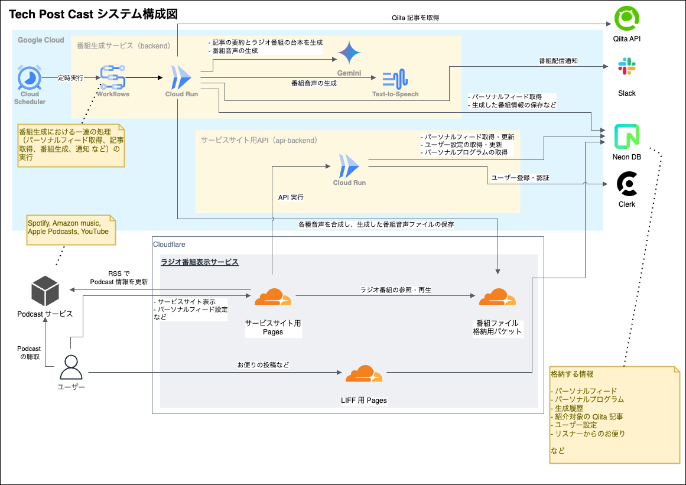

# 🎙️ Tech Post Cast

## 📖 概要

**Tech Post Cast**は、Qiitaの技術記事をAIが音声で解説するラジオ番組配信サービスです。毎朝7時に最新のIT技術トレンドをキャッチアップできるよう、人気記事をAIのMC「ポステル」が約10分でわかりやすく解説する番組を自動生成・配信しています。

「読む」から「聴く」へ。忙しい開発者が移動中や作業中でも効率的に技術情報をキャッチアップできる、新しいメディア体験を提供します。

## ✨ 主な機能

### 🎯 コア機能

- **毎日自動配信**: 毎朝7時に最新エピソードを自動生成・配信
- **AI解説**: AIのMC「ポステル」がQiitaの人気記事を分かりやすく解説
- **チャプター機能**: 記事ごとにチャプターを設定し、興味のある箇所に瞬時にスキップ可能
- **マルチプラットフォーム配信**: Spotify、Amazon Music、Apple Podcasts、YouTubeで配信

### 🎨 パーソナライズ機能

- **パーソナルフィード**: ユーザーの興味に合わせた著者・タグのフォロー機能
- **複数話者モード**: ポステル（司会）とジョン（専門家）の対話形式での解説
- **配信カスタマイズ**: 配信頻度・タイミングの個別設定
- **Slack通知**: 番組配信時の通知機能

### 🎧 ユーザー体験

- **ラジオ番組品質**: BGM・効果音による本格的な番組演出
- **RSS対応**: お気に入りのPodcastアプリで購読可能
- **リスナー参加**: お便り機能による双方向コミュニケーション

## 🎯 プロジェクトの目的

1. **情報収集の効率化**: 忙しい開発者の「ながら時間」を活用した技術情報キャッチアップ
2. **習慣化の促進**: 毎日決まった時間の配信による学習習慣の形成
3. **アクセシビリティ向上**: 音声による情報提供で、より多くの人が技術情報にアクセス可能
4. **コミュニティ形成**: リスナー参加型のコンテンツによる技術者コミュニティの活性化

## 🌟 特徴・こだわり

- **高品質な音声合成**: Google Cloud Text-to-Speech APIによる自然な音声
- **SSML対応**: 技術用語の読み間違いを防ぐ発音制御
- **本格的なラジオ番組**: 実際のFMラジオを参考にした番組構成
- **チャプター付与**: 音声ファイルにチャプターを付けて、聴きたい箇所へ簡単にアクセス
- **キャラクター設定**: ジョン・ポステル（インターネットの父）にオマージュを捧げたMC設定
- **データエグレス無料**: Cloudflare Pagesの活用による運用コスト最適化

## 🏗️ システム構成

本プロジェクトは、**Google CloudのAI・インフラサービス**を主軸としたモノレポ構成で構築されています。

### 🛠️ 技術スタック



#### 番組生成サービス

| 機能 | 技術スタック | 説明 |
|------|-------------|------|
| 定時実行 | `Cloud Scheduler` | 定時に番組生成処理などの実行を開始する |
| 処理フロー制御 | `Workflows` | 対象記事の取得・要約・台本生成・音声合成などの番組生成処理をワークフロー制御する |
| 記事の取得 | `Qiita API` | パーソナルフィードに沿った記事情報の検索、取得 |
| 記事要約・台本生成 | `Gemini AI`, `mastra` | 記事の要約・説明する上での要点の抽出・番組台本を生成する |
| 番組音声の生成 | `Gemini 2.5 Flash プレビュー TTS`, `ffmpeg` | 番組台本を元に音声合成し、BGM や効果音を合成する |
| 実行環境 | `Cloud Run`, `NestJS` | 番組生成処理の実行環境 |
| データベース | `Neon DB` (PostgreSQL) | 番組情報などの保存 |
| 通知 | `Slack` | 番組生成結果の通知 |

#### サービスサイト

| 機能 | 技術スタック | 説明 |
|------|-------------|------|
| API提供 | `Cloud Run`, `NestJS` | サービスサイト向け API の提供 |
| 音声ファイル配信 | `Cloudflare R2` | 番組音声ファイルの保存とCDN経由の配信 |
| サービスサイト | `Cloudflare Pages`, `Nuxt3` | サービスサイトの配信 |
| ユーザー認証 | `Clerk` | ユーザー認証 |

#### 開発・運用

| 機能 | 技術スタック | 説明 |
|------|-------------|------|
| コード管理 | `GitHub` | コードのリポジトリ |
| CI/CD | `Cloud Build`, `GitHub Actions` | CI, CD |

### 📁 プロジェクト構造

```txt
tech-post-cast/
├── apps/                # アプリケーション
│   ├── api-backend/     # バックエンドAPI (NestJS)
│   ├── backend/         # 番組生成用バックエンドAPI (NestJS)
│   ├── lp-frontend/     # サービスサイトフロントエンド (Nuxt3)
│   ├── liff-frontend/   # LIFFフロントエンド (Nuxt3)
│   ├── line-bot/        # LINEボット (Hono)
│   └── infra/           # インフラストラクチャコード (AWS CDK) ※ **deprecated**
├── packages/            # 共有パッケージ
│   ├── database/        # データベース関連コード・スキーマ (Prisma)
│   └── commons/         # 共通ユーティリティと機能
└── docs/                # プロジェクトドキュメント
    └── coding-rules/    # 詳細なコーディングルール
```

### 🔄 番組生成フロー

1. **記事取得**: Qiita APIからパーソナルフィード設定に基づいて記事を取得
2. **記事要約**: Gemini AIを使用して記事内容を要約
3. **台本生成**: mastraワークフローで番組台本を生成
4. **音声合成**: Gemini 2.5 Flash プレビュー TTSで音声を生成
5. **音声編集**: ffmpegでBGM・効果音を合成し、チャプター付与
6. **配信準備**: Cloudflare R2にアップロード、RSS更新
7. **通知**: Slack経由でユーザーに配信通知

### 🎨 アーキテクチャの特徴

- **マイクロサービス構成**: 各機能を独立したサービスとして分離
- **サーバーレス**: Cloud RunやLambdaを活用したスケーラブルな構成
- **コスト最適化**: Cloudflare R2のデータエグレス無料を活用
- **AI統合**: 複数のAIサービスを組み合わせた高品質なコンテンツ生成
- **モノレポ**: Yarnワークスペースによる効率的な開発環境

## 💻 開発の始め方

### 📋 前提条件

開発環境のセットアップには以下のツールが必要です：

- **Node.js**: v20.14.0（`.node-version`で指定）
- **Yarn**: v1.22.19+
- **Docker & Docker Compose**: データベースとサービスの起動用
- **Git**: バージョン管理

### 🚀 セットアップ手順

#### 1. リポジトリのクローン

```bash
git clone https://github.com/your-org/tech-post-cast.git
cd tech-post-cast
```

#### 2. 依存関係のインストール

```bash
# Yarnワークスペースで全ての依存関係をインストール
yarn install
```

#### 3. 環境変数の設定

各アプリケーションに必要な環境変数ファイルを作成：

```bash
# API Backend用
cp apps/api-backend/.env.example apps/api-backend/.env

# Backend用
cp apps/backend/.env.example apps/backend/.env

# LP Frontend用
cp apps/lp-frontend/.env.example apps/lp-frontend/.env

# LIFF Frontend用
cp apps/liff-frontend/.env.example apps/liff-frontend/.env
```

#### 4. データベースのセットアップ

```bash
# PostgreSQL（pgvector拡張付き）をDocker Composeで起動
docker-compose up -d db

# Prismaマイグレーションの実行
yarn deploy-migration-prisma

# シードデータの投入（任意）
yarn seed-prisma
```

### 🏃‍♂️ 各アプリケーションの起動方法

#### 開発サーバーの起動

```bash
# API Backend（ポート: 3001）
yarn start:api-backend

# Backend（番組生成用、ポート: 3000）
yarn start:backend

# LP Frontend（サービスサイト）
yarn start:lp-frontend

# LIFF Frontend
yarn start:liff-frontend

# LINE Bot
yarn start:line-bot
```

#### Docker Composeでの起動

```bash
# 全サービスを一括起動
docker-compose up -d

# 特定のサービスのみ起動
docker-compose up -d api-backend backend db
```

### 🔨 ビルド手順

#### 個別ビルド

```bash
# 共通パッケージのビルド
yarn build-commons

# データベースパッケージのビルド
yarn build-database

# API Backendのビルド
yarn build:api-backend

# Backendのビルド
yarn build-backend

# LP Frontendのビルド
yarn build:lp-frontend
```

#### 一括ビルド

```bash
# Backend系の一括ビルド
yarn build-for-backend

# API Backend系の一括ビルド
yarn build:for-api-backend
```

### 🧪 テスト実行

```bash
# 全テストの実行
yarn test

# 個別テストの実行
yarn test-backend
yarn test-commons
yarn test-database
yarn test-infra
```

### 🗄️ データベース操作

```bash
# Prismaスキーマのフォーマット
yarn format-prisma

# Prismaクライアントの生成
yarn generate-prisma

# マイグレーションファイルの作成
yarn create-migration-prisma

# マイグレーションの適用
yarn deploy-migration-prisma
```

### 📋 API仕様書の生成

```bash
# 全API仕様書の生成
yarn generate:api-spec

# 個別API仕様書の生成
yarn generate:api-spec:backend
yarn generate:api-spec:for-frontend
yarn generate:api-spec:line-bot

# APIクライアントの生成
yarn generate:api-client
```

### 🐳 開発環境のリセット

```bash
# Dockerコンテナとボリュームの削除
docker-compose down -v

# node_modulesの削除と再インストール
rm -rf node_modules apps/*/node_modules packages/*/node_modules
yarn install

# データベースの再構築
docker-compose up -d db
yarn deploy-migration-prisma
```
