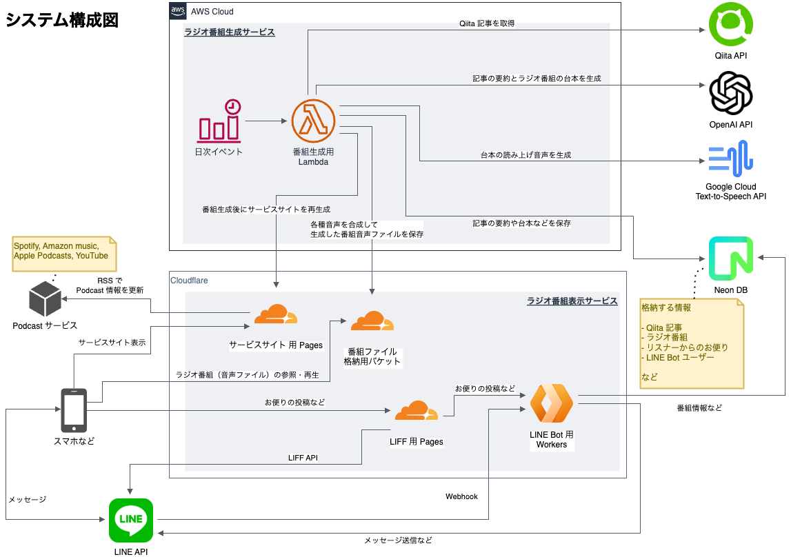

# Tech Post Cast

人気のIT技術記事をAIが解説するラジオ番組を毎日配信

 

**Webサービス開発者の会 #17**

 
 

2025.03.19

Sumihiro Kagawa

---

# 目次

- 自己紹介
- Tech Post Cast とは
- DEMO
- こだわりポイント
- システム構成
    - 実行環境構成
    - ソフトウェア構成
- AI ラジオ番組生成フロー
- 開発スケジュール
- 運用コスト

---

# sumihiro3 の自己紹介

    

        
    

    

- 名前
    - 加川澄廣
- 居住地
    - 兵庫県
- 所属
    - 株式会社ブレイブテクノロジー
        - LINE ミニアプリの順番待ちサービスなどを開発
        - 取締役、開発責任者
- その他
    - LINEヤフー社認定 LINE API Expert (2019年〜)

    

---

# 略歴

| いつ | 何をしていたか |
| :---- | :---- |
| 大学生 | 商学部経営学科 |
| 新卒 | 簿記の資格を活かしたく在阪企業の経理部で財務・経理に従事した |
| 27歳 | プログラマーへ転職し東京へ |
| 〜35歳 | 請負開発や SES で開発、設計、リーダー、アーキテクト等を担当した |
| 〜48歳 | IT コンサルで主に PM を担当した（製造業、電子書籍サービス、自治体など） |
| 43歳頃 | 関西に戻る  LINE API での開発やハッカソン、ものづくり、ハンズオン活動に目覚める その活動がきっかけで LINE API Expert に認定いただく |
| 48歳〜 | LINE ミニアプリを使った順番待ちサービスの開発責任者 |
| 2025年 | Tech Post Cast を個人開発してリリース |

---

# Tech Post Cast とは

## AIパーソナリティによるラジオ番組

- 人気IT技術記事をAIが解説する毎日配信のポッドキャスト
- 忙しい開発者が最新技術トレンドをキャッチアップできるサービス

---

# Tech Post Cast とは

## 主な機能

- 毎朝7時に自動で番組を生成して配信する（約10分番組）
- Qiita人気記事を AI のパーソナリティが解説する
- BGM・効果音で本物のラジオ番組のように演出する
- リスナーからのお便りを紹介する

---
</style>

## 主な特徴

- 毎朝7時に自動配信（約10分番組）
- Qiita人気記事のAI解説
- リスナーからのお便り紹介
- BGM・効果音で本物のラジオ演出

---

# Tech Post Cast とは

## 利用方法と開発背景

- 各種ポッドキャストプラットフォームで購読可能
- Webサイトでも直接視聴可能
- 通勤・家事などの「ながら時間」活用を想定した個人開発プロジェクト

---

# こだわりポイント

- **本物のラジオ番組感**
    - パーソナリティの個性と自然な話し方
    - BGM・効果音による番組演出
    - 定型的なオープニング・エンディング構成

- **技術コンテンツの質とサステナビリティ**
    - Qiita人気記事の厳選と適切な要約解説
    - 専門用語の正確な発音と説明
    - フルオートメーションによる毎日配信
    - 低コスト運用（月額200円以下）とサーバーレス構成

- **ユーザーエンゲージメント**
    - リスナー投稿システム実装とSNS連携

---

---

# ソフトウェア構成

## フロントエンド

- Nuxt3 (SSG)
    - サービスサイト
- Nuxt3 (SPA)
    - リスナー投稿フォーム
- Vuetify
- TypeScript

## バックエンド

- NestJS（番組生成用バックエンド）
- Hono（LINE API 用バックエンド）
- Prisma
- TypeScript
- FFmpeg
    - 音声ファイル編集・合成
- AWS Lambda Web Adapter

---

# AI ラジオ番組生成フロー

1. 定時（6:55）に生成処理開始 (EventBridge→Lambda)
1. Qiita から人気記事を取得（Qiita API）
1. 記事内容を要約（gpt-4o-mini）
1. リスナーからのお便り取得 (DB)
1. 番組の台本生成（gpt-4o）
1. 番組音声を生成（Google TTS）

7. BGM, 効果音と合成し、チャプター付与（FFmpeg）
1. 番組音声ファイルをアップロード（Cloudflare R2）
1. 番組台本のベクトル化、DB 更新 (DB)
1. サイトの再生成（Nuxt3 SSG）
1. RSS 経由で Podcast 番組更新（Nuxt3 SSG）
1. 番組公開のポスト（Twitter API）

---

# 開発スケジュール

---

# 運用コスト（2025.2）

※開発での試用を含める

| 利用サービス | 料金（ドル/月） | 備考 |
| :---- | ----: | :---- |
| AWS   (ECR, Lambda, CloudWatch, CDK etc.) | 0.70 | ECR: 0.65 |
| Google Cloud (Speech-to-Text) | 0.00 | 約13万文字 / 1M文字 |
| Cloudflare (Workers, Pages, R2) | 0.00 | |
| OpenAI API   (gpt-4o, gpt-4o-mini, text-embedding-3-small) | 0.47 | 287 requests   1.4M tokens |
| Neon (PostgreSQL) | 0.00 | |
| 合計 | 1.17 | ≒ 181円 |
