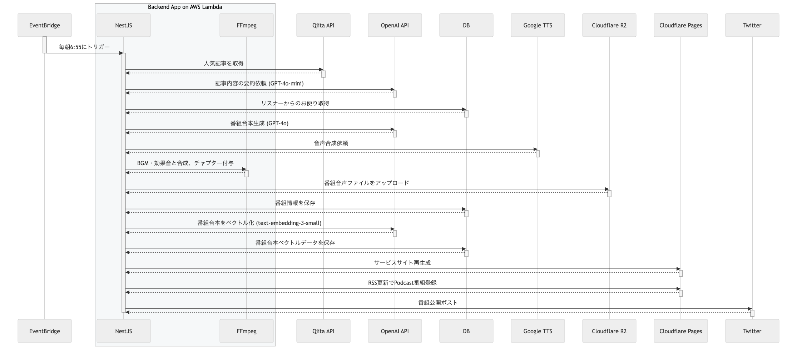

# Tech Post Cast

人気のIT技術記事をAIが解説する
ラジオ番組を毎日配信

 

## Webサービス開発者の会 #17

 
 

2025.03.19

Sumihiro Kagawa

---

# 目次

- 自己紹介
- Tech Post Cast とは
- 開発した経緯や背景
- DEMO
- システム構成
- こだわりポイント
    - AI ラジオ番組生成フロー
    - 運用コスト
- 開発スケジュール
- 今後の機能追加予定

---

# sumihiro3 の自己紹介

    

        
    

    

- 名前
    - 加川澄廣
- 居住地
    - 兵庫県
- 所属
    - 株式会社ブレイブテクノロジー
        - LINE ミニアプリの順番待ちサービスなどを開発
        - 取締役、開発責任者
- その他
    - LINEヤフー社認定 LINE API Expert (2019年〜)

    

---

# 略歴

| いつ頃 | 何をしていたか |
| :---- | :---- |
| 大学生 | 商学部経営学科 |
| 新卒 | 簿記の資格を活かしたく在阪企業の経理部で財務・経理に従事した |
| 27歳 | プログラマーへ転職し東京へ |
| 〜35歳 | 請負開発や SES で開発、設計、リーダー、アーキテクト等を担当した |
| 〜48歳 | IT コンサルで主に PM を担当した（製造業、電子書籍サービス、自治体など） |
| 43歳頃 | 関西に戻った後に LINE API での開発やハッカソン、個人開発、ハンズオン活動に目覚める その活動がきっかけで LINE API Expert に認定いただく |
| 48歳〜 | LINE ミニアプリを使った順番待ちサービスの開発責任者（現職） |
| 2025年2月 | Tech Post Cast を個人開発してリリース |

---
<!-- _class: lead -->

# Tech Post Cast とは

---

# Tech Post Cast とは

## 人気IT技術記事をAIのMCが解説する AI ラジオ番組配信サービス

- 最新技術トレンドをキャッチアップできるよう、Qiita の人気IT技術記事をAIのMCが解説するラジオ番組を毎日配信しているサービス

---

# Tech Post Cast とは

## 主な機能

- 毎朝7時に自動で番組を生成して配信
- Qiita人気記事を AI のMC「ポステル」が解説
- リスナーからのお便りを紹介

---

# 開発した経緯や背景

- 日々進化する技術トレンドを手軽にキャッチアップしたい
- 散歩や家事などの「ながら時間」を活用したい
- 習慣化できるよう毎日決まった時間に配信してほしい

---

# DEMO

[Demo Page](https://techpostcast.com/headline-topic-programs/cm7nvz9xo0000l50z44ip3hjx)

---
<!-- _class: lead -->

# システム構成

---

---

# ソフトウェア構成

## フロントエンド

- Nuxt3 (SSG)
    - サービスサイト
- Nuxt3 (SPA)
    - リスナー投稿フォーム
- Vuetify
- TypeScript

## バックエンド

- NestJS（番組生成用バックエンド）
- Hono（LINE Bot 用バックエンド）
- Prisma
- TypeScript
- FFmpeg
    - 音声ファイル編集・合成
- AWS Lambda Web Adapter

---
<!-- _class: lead -->

# こだわりポイント

---

# こだわりポイント（1/n）

## 本物のラジオ番組感を出す

- **パーソナリティの個性と自然な話し方**
    - 番組台本生成プロンプトで、MC「ポステル」の性格や口調などを設定
    - Google TTS で、声の高さや話す速度をチューニング
- **定型的なオープニング・エンディング構成**
    - 実際のラジオ番組のように、オープニングで MCの挨拶や日付に応じたコメントを挿入
    - エンディングでは、紹介した記事を簡単に振り返る
- **ユーザーエンゲージメント**
    - リスナーからのお便りを紹介して、MC がコメントする

---

# こだわりポイント（2/n）

## 番組の聴きやすさを重視

- **AIが対応していない最新の用語を補正**
    - 間違った読み方をしている場合は用語登録して補正する
- **BGMや効果音を活用**
    - 音声合成処理とは別で BGM や、記事間の効果音を合成してメリハリをつける
- **チャプターですぐに聞きたい箇所へ**
    - オープニングや各記事、エンディングなど好きな箇所へワンタップで到達できる

---

# こだわりポイント（3/n）

## 定常処理の完全自動化

- **番組生成や Podcast サービスへの配信といった定常処理は完全自動化**
    - 毎朝定時に番組の音声ファイルを生成開始
    - サービスサイトは番組音声ファイル生成後に自動で再生成
    - 各 Podcast サービスへの番組配信も RSS 再生成で自動化

---

# AI ラジオ番組生成・配信フロー

---

# こだわりポイント（4/n）

## 低コストでの運用を目指す

- **作業工数**
    - 毎日配信でも人手はかけず完全自動化
    - サーバーレス構成で運用の手間を最小限に
    - インフラを AWS CDK で構築することで環境構築の手間、差異を最小限に
    - 番組の再生成や用語登録は管理用APIで簡単実行
- **費用**
    - 生成AIを使うが費用もできるだけ抑える（月額200円以下）

---

# 運用費用（2025.2）

| 利用サービス | 料金（ドル/月） | 備考 |
| :---- | ----: | :---- |
| AWS   (ECR, Lambda, CloudWatch, CDK etc.) | 0.70 | ECR: 0.65 |
| Google Cloud (Text-to-Speech) | 0.00 | 約13万文字 / 1M文字 |
| Cloudflare (Workers, Pages, R2) | 0.00 | |
| OpenAI API   (gpt-4o, gpt-4o-mini, text-embedding-3-small) | 0.47 | 287 requests   1.4M tokens |
| Neon (PostgreSQL) | 0.00 | |
| 合計 | 1.17 | ≒ 181円 |

※開発環境や開発時の試用を含める

---
<!-- _class: lead -->

# 開発スケジュール

---

# 開発スケジュール

---
<!-- _class: lead -->

# 今後の機能追加予定

---

# 今後の機能追加予定

- **パーソナライズした番組の配信**
    - ユーザーが指定した条件（タグや著者など）で興味がある番組を個別配信
    - 好みの MC 、BGM の選択
- **配信オプションのカスタマイズ**
    - 配信頻度の選択（日次、週次、記事数ベース）
    - 配信タイミングの指定（朝の通勤時間向け、夜の就寝前など）
- **コンテンツの拡張**
    - リスナーからのお便りを紹介して、MC がコメントする

これらの有料（一部無料）機能を追加してマネタイズを目指す

---

# Qiita での解説記事

---
<!-- _class: lead -->

# ご清聴ありがとうございました

